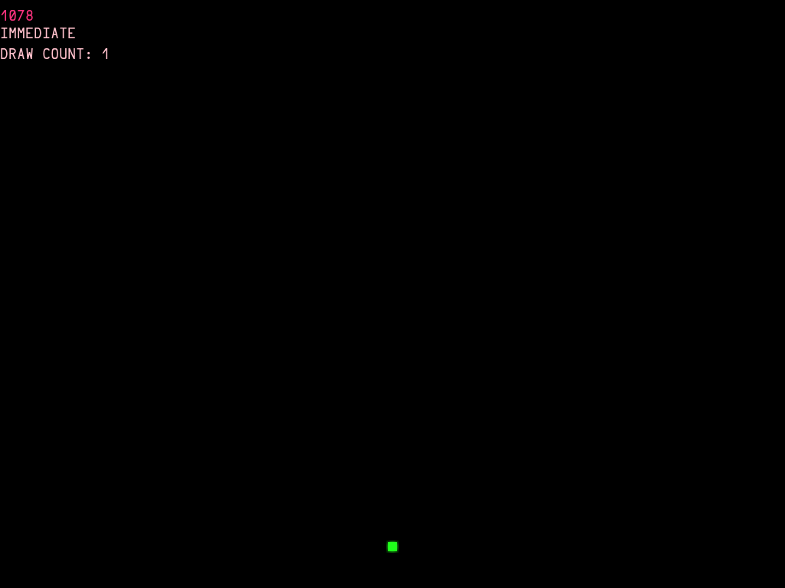
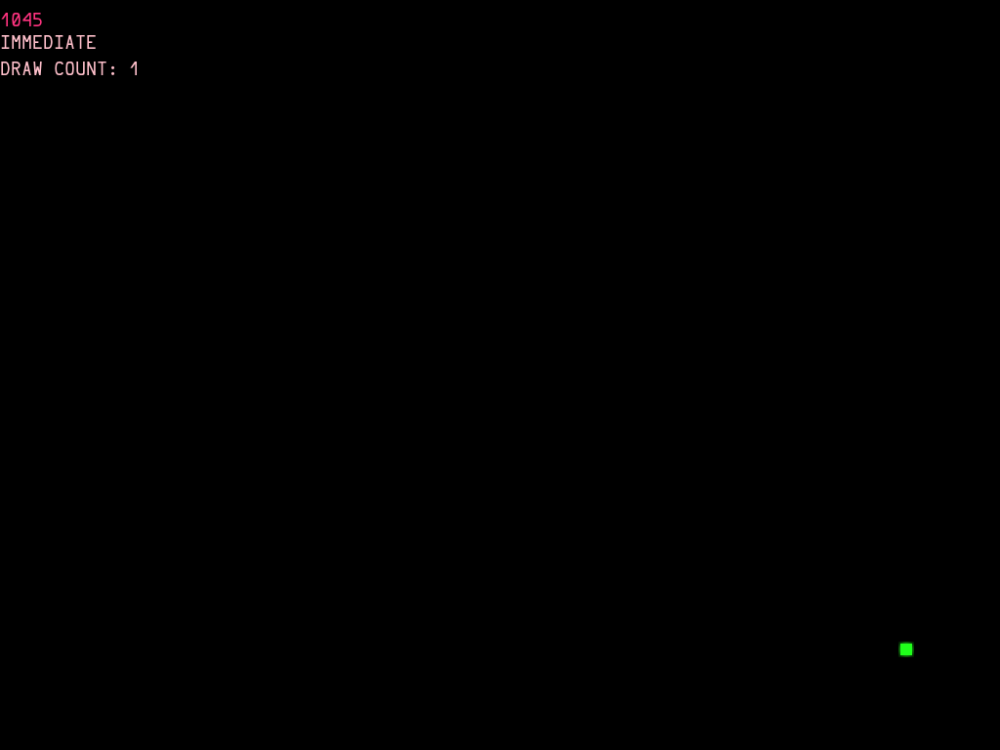

Worksheet 5
================
James Huxtable
16 October 2018

## Balltastic bouncing fun game, honest!

You may well need to look at what you did in worksheet 4 in order to complete this worksheet. There is a lot of information in worksheet 4, which you can use to remind yourself how to create sprites, render them to a scene and then get them to move.

I have left some comments in the boilerplate code to indicate where you need to do certain things (note that there is not a comment for every step though!). It's worth noting that unlike the previous worksheets, you are expected to complete this with the minimal of guidance. So lets get going!

## Functionality
**Implement the following functionality in your game.**

- Set the screen colour to black
- Add text to say “Press enter to start the game” (or equivalent)
- When the player presses the Enter key:
    - Use the keyHandler to leave the menu screen ready for the game
      screen.
- You will need a ball visible in your game screen.
    - There is a ball graphic included if you wish to use it
      “data/images/8bit_ball.png”.
- Create a sprite and load the texture for your ball
- Position it in the centre of the window (use window width and height)
- Render your ball object in the window
- As the game is now started, you need the ball to move. Get the ball
  to move upwards (Hint: you are updating the scene). 
  - Experiment with values to choose how fast you want the ball to move.
- When the ball hits an edge of the window, get it to bounce and move
  in the opposite direction.
- In the Balltastic header file add a boolean ball_going_up.
  - Set it to true initially and use it to dictate which direction your
    ball moves.
- Remember to add code which tests when to set the boolean to true and
  when to set it to false (i.e. when the ball needs to bounce)

You should now have a ball that continuously bounces up and down in the
centre of your screen when you start your game.




## Using vectors

Next, we want to get the ball bouncing at angles. 

To do that create a class 
called Vector. Start by creating new files for the header and cpp
class files (in Source). Ensure the new files are  added to the executable
listed in the CMake file. If using CLion it should prompt you to add them, 
select the ${PROJECT_NAME} target and double check to ensure they are added. 

You will need the following members in the Vector class:

- Variables for x and y values (i.e. the direction of travel)
- A Function for normalising the vector. (Normalising a vector means making a vector into a unit vector)
  - ``` void normalise(); ```
- A Function to multiply the vector by a scalar value. 
  - **Note: If you want to override an operator symbol, rather than writing a function name, you can define your function as:** 
  - ```Vector operator*(float scalar);```

*NB: Create and declare your Vector class in the header file and implement (define) the functions listed in your cpp file.*

## Now Back to your main game

Let's make the game more interesting.

To do:

- Remember to #include “Vector.h” in your BouncingBall header file (if you have problems double check your file    
  locations).
- Using your new class, create a Vector object that will store the ball_direction, say (2,3).
  - You will now use this in place of ball_going_up so you can remove that variable.
- Start the ball moving using those vector values, it will now move at an angle rather than directly up. 
  - **Note:** that you are now updating x and y values.
  - **Note:** that you might need to adjust your ball speed.
- Adjust your code for when the ball hits a wall, the ball should now bounce off at an angle. 
  - **Hint:** When the ball reaches a wall, adjust your ball_direction vector value accordingly.
    - Think about how the vector would change when the ball hits a wall at an angle.

Congratulations! You know have a basic ball bouncing. Sit back and bask in your glory
and all the while think about all the amazing games you know have the skills to create! 

**!!!Anyone fancy a game of PONG!!!**

